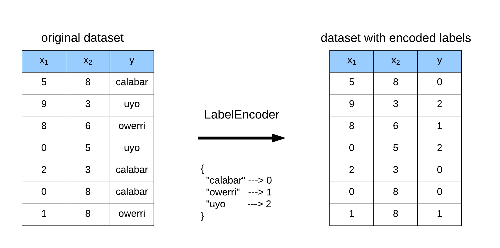
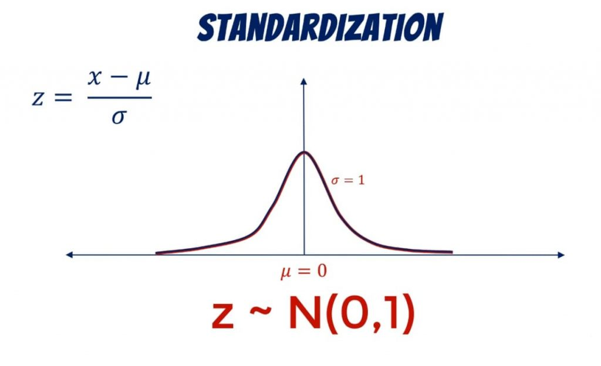
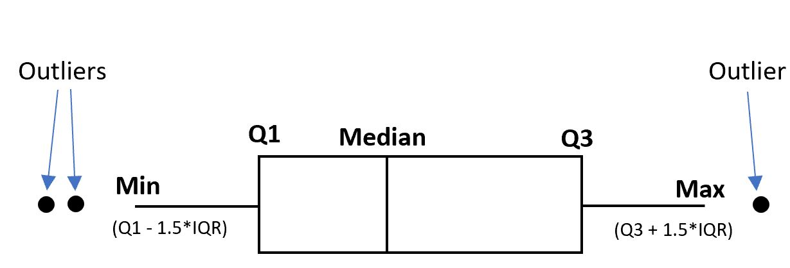
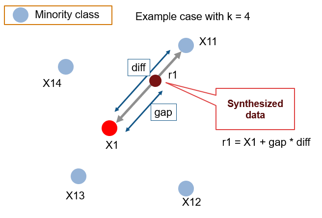

# DỰ ĐOÁN CHURN KHÁCH HÀNG THẺ TÍN DỤNG SỬ DỤNG NUMPY

Dự án phân tích và dự đoán hành vi churn (ngừng sử dụng dịch vụ) của khách hàng thẻ tín dụng sử dụng các thuật toán Machine Learning được xây dựng hoàn toàn bằng NumPy thuần túy.

---

## Mục Lục

1. [Giới Thiệu](#giới-thiệu)
   - [Mô Tả Bài Toán](#mô-tả-bài-toán)
   - [Động Lực và Ứng Dụng Thực Tế](#động-lực-và-ứng-dụng-thực-tế)
   - [Mục Tiêu Cụ Thể](#mục-tiêu-cụ-thể)
2. [Dataset](#dataset)
   - [Nguồn Dữ Liệu](#nguồn-dữ-liệu)
   - [Mô Tả Các Features](#mô-tả-các-features)
   - [Kích Thước và Đặc Điểm Dữ Liệu](#kích-thước-và-đặc-điểm-dữ-liệu)
3. [Method](#method)
   - [Quy Trình Xử Lý Dữ Liệu](#quy-trình-xử-lý-dữ-liệu)
   - [Thuật Toán Sử Dụng](#thuật-toán-sử-dụng)
4. [Installation & Setup](#installation--setup)
5. [Usage](#usage)
6. [Results](#results)
   - [Kết Quả Đạt Được](#kết-quả-đạt-được)
   - [Trực Quan Hóa Kết Quả](#trực-quan-hóa-kết-quả)
   - [So Sánh và Phân Tích](#so-sánh-và-phân-tích)
7. [Project Structure](#project-structure)
8. [Challenges & Solutions](#challenges--solutions)
9. [Future Improvements](#future-improvements)
10. [Contributors](#contributors)
11. [Thông Tin Tác Giả](#thông-tin-tác-giả)
12. [Contact](#contact)
13. [License](#license)

---

## Giới Thiệu

### Mô Tả Bài Toán

Một quản lý tại ngân hàng đang bối rối vì ngày càng nhiều khách hàng rời bỏ dịch vụ thẻ tín dụng của họ. Họ rất mong muốn có thể dự đoán được khách hàng nào sắp churn để chủ động tiếp cận, cung cấp dịch vụ tốt hơn và thay đổi quyết định của khách hàng theo hướng tích cực.

**Churn prediction** là bài toán phân loại nhị phân dự đoán khách hàng có khả năng ngừng sử dụng dịch vụ hay không. Trong lĩnh vực ngân hàng và thẻ tín dụng, việc nhận diện sớm khách hàng có nguy cơ churn mang lại nhiều lợi ích:

- **Tiết kiệm chi phí**: Chi phí thu hút khách hàng mới cao gấp 5-25 lần so với giữ chân khách hàng cũ
- **Tăng doanh thu**: Áp dụng các chiến dịch retention hiệu quả dựa trên phân tích dữ liệu
- **Cải thiện trải nghiệm**: Cung cấp dịch vụ cá nhân hóa cho từng nhóm khách hàng
- **Giảm tỷ lệ mất khách**: Chủ động can thiệp trước khi khách hàng rời bỏ dịch vụ

### Động Lực và Ứng Dụng Thực Tế

**Tại sao sử dụng NumPy thuần túy?**

1. **Hiểu sâu về thuật toán**: Xây dựng từ đầu giúp nắm vững bản chất và cơ chế hoạt động của các thuật toán Machine Learning
2. **Không phụ thuộc thư viện black-box**: Kiểm soát hoàn toàn code, không bị giới hạn bởi scikit-learn, TensorFlow hay PyTorch
3. **Tối ưu hiệu suất**: Tận dụng NumPy vectorization để tính toán nhanh trên ma trận và vector

**Ứng dụng thực tế:**

- Ngân hàng và tổ chức tín dụng: Dự đoán khách hàng rời bỏ dịch vụ
- Viễn thông: Phát hiện khách hàng có ý định chuyển nhà mạng
- E-commerce: Nhận diện khách hàng không còn mua sắm
- Dịch vụ subscription: Dự đoán người dùng huỷ đăng ký

### Mục Tiêu Cụ Thể

1. **Xây dựng thuật toán từ đầu**: Implement các thuật toán ML (Logistic Regression, KNN, Naive Bayes, Random Forest) hoàn toàn bằng NumPy
2. **So sánh preprocessing strategies**: Đánh giá hiệu quả của Basic preprocessing vs Enhanced preprocessing (SMOTE, Feature Engineering)
3. **Phân tích model insights**: Sử dụng confusion matrix, feature importance, sensitivity/specificity để hiểu rõ model behavior
4. **Đánh giá model stability**: Cross-validation để kiểm tra độ ổn định của model trên nhiều folds khác nhau
5. **Giải quyết class imbalance**: Xử lý vấn đề mất cân bằng dữ liệu (83.93% vs 16.07%) bằng SMOTE

---

## Dataset

### Nguồn Dữ Liệu

**Bank Churners Dataset**

- **Nguồn**: [Leaps Analyttica](https://leaps.analyttica.com/home) / Kaggle
- **Tác giả**: Sakshi Goyal
- **License**: CC0: Public Domain
- **File**: `data/raw/BankChurners.csv` (1.51 MB)
- **Update frequency**: Never (Updated 5 years ago)

**Cách thu thập dữ liệu**:

1. Đăng nhập vào website https://leapsapp.analyttica.com/home
2. Tại đây có nhiều bài toán kinh doanh khác nhau để giải quyết và dataset tương ứng

**Mô tả**:

Quản lý kinh doanh của một danh mục thẻ tín dụng tiêu dùng đang đối mặt với vấn đề khách hàng rời bỏ dịch vụ (customer attrition). Dataset này chứa thông tin về 10,000 khách hàng với các đặc điểm như tuổi, lương, tình trạng hôn nhân, hạn mức thẻ tín dụng, loại thẻ, v.v. Có tổng cộng 18 features hữu ích.

### Mô Tả Các Features

**Target Variable:**


| Feature          | Mô tả                                                                                                                   |
| ------------------ | --------------------------------------------------------------------------------------------------------------------------- |
| `Attrition_Flag` | Biến sự kiện nội bộ - nếu tài khoản bị đóng thì là "Attrited Customer", ngược lại là "Existing Customer" |

**Thông tin định danh:**


| Feature     | Mô tả                                                                   |
| ------------- | --------------------------------------------------------------------------- |
| `CLIENTNUM` | Mã số khách hàng - định danh duy nhất cho người giữ tài khoản |

**Demographic Features (Đặc điểm nhân khẩu học):**


| Feature           | Mô tả                                                                                                                 |
| ------------------- | ------------------------------------------------------------------------------------------------------------------------- |
| `Customer_Age`    | Tuổi của khách hàng (năm)                                                                                          |
| `Gender`          | Giới tính - M=Male (Nam), F=Female (Nữ)                                                                              |
| `Dependent_count` | Số người phụ thuộc                                                                                                 |
| `Education_Level` | Trình độ học vấn (ví dụ: High School, College Graduate, Graduate, Post-Graduate, Doctorate, Uneducated, Unknown) |
| `Marital_Status`  | Tình trạng hôn nhân (Married, Single, Divorced, Unknown)                                                            |
| `Income_Category` | Mức thu nhập hàng năm (< $40K, $40K - $60K, $60K - $80K, $80K - $120K, > $120K, Unknown)                            |

**Product Features (Đặc điểm sản phẩm):**


| Feature         | Mô tả                                   |
| ----------------- | ------------------------------------------- |
| `Card_Category` | Loại thẻ (Blue, Silver, Gold, Platinum) |

**Banking Relationship Features (Quan hệ với ngân hàng):**


| Feature                    | Mô tả                                                   |
| ---------------------------- | ----------------------------------------------------------- |
| `Months_on_book`           | Số tháng đã là khách hàng của ngân hàng         |
| `Total_Relationship_Count` | Tổng số sản phẩm đã sử dụng                       |
| `Months_Inactive_12_mon`   | Số tháng không hoạt động trong 12 tháng gần nhất |
| `Contacts_Count_12_mon`    | Số lần liên hệ trong 12 tháng gần nhất             |

**Financial Metrics (Chỉ số tài chính):**


| Feature                 | Mô tả                                                                  |
| ------------------------- | -------------------------------------------------------------------------- |
| `Credit_Limit`          | Hạn mức tín dụng của thẻ                                           |
| `Total_Revolving_Bal`   | Tổng số dư đáo hạn trên thẻ tín dụng                           |
| `Avg_Open_To_Buy`       | Hạn mức còn lại trung bình (Credit Limit - Total Revolving Balance) |
| `Total_Amt_Chng_Q4_Q1`  | Thay đổi giá trị giao dịch từ Q4 so với Q1                        |
| `Total_Trans_Amt`       | Tổng giá trị giao dịch trong 12 tháng gần nhất                    |
| `Total_Trans_Ct`        | Tổng số lượng giao dịch trong 12 tháng gần nhất                  |
| `Total_Ct_Chng_Q4_Q1`   | Thay đổi số lượng giao dịch từ Q4 so với Q1                      |
| `Avg_Utilization_Ratio` | Tỷ lệ sử dụng hạn mức tín dụng trung bình                       |

### Kích Thước và Đặc Điểm Dữ Liệu

**Tổng quan:**

- **Tổng số mẫu**: 10,127 khách hàng
- **Tổng số features**: 23 cột
- **Missing values**: Không có giá trị null
- **Duplicate records**: Không có bản ghi trùng lặp

**Phân bố class (Class Distribution):**

- **Existing Customer (Không churn)**: 8,500 khách hàng (83.93%)
- **Attrited Customer (Churn)**: 1,627 khách hàng (16.07%)
- **Đặc điểm**: Dataset có **class imbalance** nghiêm trọng, khiến việc train model khó khăn hơn

**Phân loại features được sử dụng:**

- **Numerical features**: 14 features (Customer_Age, Dependent_count, Credit_Limit, Total_Trans_Amt, v.v.)
- **Categorical features**: 5 features (Gender, Education_Level, Marital_Status, Income_Category, Card_Category)

**Train/Test Split:**

- **Training set**: 80% (8,101 samples)
- **Test set**: 20% (2,026 samples trước SMOTE, 3,400 samples sau SMOTE cho Enhanced version)

---

## Method

### Quy Trình Xử Lý Dữ Liệu

#### 1. Data Exploration (`01_data_exploration.ipynb`)

**Mục đích**: Hiểu rõ đặc điểm và patterns của dữ liệu

**Các bước thực hiện**:

- **Load data**: Sử dụng `np.genfromtxt()` để đọc CSV file
- **Thống kê mô tả**: Tính mean, median, std, min, max, quartiles cho từng feature
- **Phân tích phân phối**:
  - Histogram cho numerical features
  - Count plots cho categorical features
- **Correlation analysis**: Tính correlation matrix để phát hiện features có quan hệ tuyến tính
- **Outlier detection**: Sử dụng Z-score và IQR method
- **Churn patterns**: Phân tích sự khác biệt giữa churned và existing customers

**Key findings**:

- Features quan trọng: `Total_Trans_Ct`, `Total_Trans_Amt`, `Total_Revolving_Bal`
- Khách hàng churn thường có số lượng giao dịch thấp hơn
- Class imbalance cần được xử lý

#### 2. Data Preprocessing (`02_preprocessing.ipynb`)

**2.1. Basic Preprocessing**

Pipeline đơn giản cho baseline model:

1. **Handle Missing Values**:

   - Sử dụng median imputation cho numerical features
   - Mode imputation cho categorical features
2. **Outlier Detection**:

   - Phát hiện outliers bằng Z-score method
   - Không xoá outliers, chỉ đánh dấu để theo dõi
3. **Feature Encoding**:

   - Label Encoding cho tất cả categorical features
   - Convert sang numeric values (0, 1, 2, ...)



4. **Standardization**:
   - Z-score normalization: `z = (x - μ) / σ`
   - Đưa tất cả features về cùng scale



5. **Train-Test Split**:
   - 80% training, 20% test
   - Random shuffle với seed cố định (42)

**2.2. Enhanced Preprocessing**

Pipeline nâng cao để cải thiện performance:

1. **Feature Encoding Advanced**:

   - Label Encoding cho ordinal features
   - One-Hot Encoding cho nominal features
2. **Outlier Handling**:

   - IQR method để phát hiện outliers
   - Capping outliers thay vì xoá



3. **Z-score Standardization**: Tương tự Basic
4. **SMOTE (Synthetic Minority Over-sampling Technique)**:

   - Giải quyết class imbalance
   - Tạo synthetic samples cho minority class (Churned customers)
   - Sử dụng KNN để generate samples
   - Tăng số lượng mẫu Churned lên ngang với Existing



**Công thức SMOTE**:

Với mỗi sample thuộc minority class \( x_i \):

1. Tìm k nearest neighbors trong cùng class
2. Chọn ngẫu nhiên một neighbor \( x_{zi} \)
3. Tạo synthetic sample:

$$
x_{new} = x_i + \lambda \times (x_{zi} - x_i)

$$

Trong đó $\lambda \in [0, 1]$ là số ngẫu nhiên.

5. **Principal Component Analysis (PCA)**:
   - Dimensionality reduction
   - Giảm từ n features xuống k principal components
   - Giữ lại 97% variance


**Công thức PCA**:

1. Tính covariance matrix:

   $$
   C = \frac{1}{n-1} X^T X

   $$
2. Eigenvalue decomposition:

   $$
   C = V \Lambda V^T

   $$
3. Project data:

   $$
   X_{pca} = X \cdot V_k

   $$
4. **Feature Engineering**:

   - Transaction velocity: `Total_Trans_Amt / Total_Trans_Ct`
   - Utilization categories dựa trên `Avg_Utilization_Ratio`
   - Activity scores dựa trên `Months_Inactive_12_mon`

**Output**: 8 files `.npy` được lưu vào `data/processed/`

#### 3. Model Training (`03_modeling.ipynb`)

**Workflow**:

1. Load cả 2 versions data (Basic và Enhanced)
2. Train 4 models trên từng version
3. Evaluate với multiple metrics
4. So sánh performance giữa Basic vs Enhanced
5. Analyze confusion matrix
6. Cross-validation để kiểm tra stability
7. Model insights và recommendations

### Thuật Toán Sử Dụng

#### 1. Logistic Regression

**Mô tả**:

Logistic Regression là thuật toán phân loại tuyến tính sử dụng sigmoid function để ánh xạ linear combination của features vào xác suất từ 0 đến 1.

**Công thức toán học**:

Sigmoid function:

$$
\sigma(z) = \frac{1}{1 + e^{-z}}

$$

Hypothesis:

$$
h_\theta(x) = \sigma(\theta^T x) = \frac{1}{1 + e^{-\theta^T x}}

$$

Loss function (Binary Cross-Entropy):

$$
J(\theta) = -\frac{1}{m} \sum_{i=1}^{m} \Big[y^{(i)} \log(h_\theta(x^{(i)})) + (1 - y^{(i)}) \log(1 - h_\theta(x^{(i)}))\Big] + \frac{\lambda}{2m} ||\theta||^2

$$

Gradient descent update:

$$
\theta_j := \theta_j - \alpha \frac{\partial J(\theta)}{\partial \theta_j}

$$

Gradient:

$$
\frac{1}{m} \sum_{i=1}^{m} (h_\theta(x^{(i)}) - y^{(i)}) x_j^{(i)} + \frac{\lambda}{m} \theta_j

$$

**Implementation với NumPy**:

```python
# Forward pass
z = np.dot(X, self.weights) + self.bias
predictions = 1 / (1 + np.exp(-z))

# Compute gradients
error = predictions - y
dw = (1/m) * np.dot(X.T, error) + (self.regularization / m) * self.weights
db = (1/m) * np.sum(error)

# Update parameters
self.weights -= self.learning_rate * dw
self.bias -= self.learning_rate * db
```

**Ưu điểm**:

- Dễ implement và interpret
- Hoạt động tốt với linearly separable data
- Output là xác suất, dễ threshold tuning

**Nhược điểm**:

- Không handle non-linear relationships
- Sensitive với outliers
- Cần feature scaling

#### 2. K-Nearest Neighbors (KNN)

**Mô tả**:

KNN là thuật toán non-parametric phân loại dựa trên k nearest neighbors. Không có training phase, chỉ lưu trữ training data và predict dựa trên majority voting.

**Công thức toán học**:

Euclidean function:

$$
d(x_i, x_j) = \sqrt{\sum_{k=1}^{n} (x_{i,k} - x_{j,k})^2}

$$

Vectorized distance matrix (tránh loops):

$$
D_{ij}^2 = \|x_i\|^2 + \|x_j\|^2 - 2\, x_i x_j^T

$$

Prediction:

$$
\hat{y} = \text{mode}(\{y_1, y_2, \ldots, y_k\})

$$

**Implementation với NumPy**:

```python
# Vectorized distance calculation
X1_squared = np.sum(X_test ** 2, axis=1, keepdims=True)
X2_squared = np.sum(X_train ** 2, axis=1, keepdims=True)
distances_squared = X1_squared + X2_squared.T - 2 * np.dot(X_test, X_train.T)
distances = np.sqrt(np.maximum(distances_squared, 0))

# Find k nearest neighbors
k_nearest_indices = np.argsort(distances, axis=1)[:, :self.k]
k_nearest_labels = self.y_train[k_nearest_indices]

# Majority voting
predictions = np.array([np.bincount(labels).argmax() for labels in k_nearest_labels])
```

**Ưu điểm**:

- Không có training phase (lazy learning)
- Hoạt động tốt với non-linear boundaries
- Không có assumptions về data distribution

**Nhược điểm**:

- Slow prediction (O(n*m) complexity)
- Sensitive với feature scaling
- Cần chọn k phù hợp

#### 3. Naive Bayes

**Mô tả**:

Naive Bayes là thuật toán dựa trên Bayes' theorem với giả định "naive" rằng các features độc lập với nhau. Gaussian Naive Bayes giả định features theo phân phối chuẩn.

**Công thức toán học**:

Bayes' theorem:

$$
P(C_k \mid x) = \frac{P(x \mid C_k) \, P(C_k)}{P(x)}

$$

Gaussian likelihood:

$$
P(x_i \mid C_k) = \frac{1}{\sqrt{2\pi\sigma_{k,i}^2}} 
\exp\left( -\frac{(x_i - \mu_{k,i})^2}{2\sigma_{k,i}^2} \right)

$$

Log probability (tránh underflow):

$$
\log P(C_k \mid x)
= \log P(C_k) + \sum_{i=1}^{n} \log P(x_i \mid C_k)

$$

**Implementation với NumPy**:

```python
# Training: compute mean and variance
for idx, c in enumerate(self.classes):
    X_c = X[y == c]
    self.means[idx] = np.mean(X_c, axis=0)
    self.variances[idx] = np.var(X_c, axis=0) + self.var_smoothing

# Prediction: compute log probabilities
log_priors = np.log(self.priors)
for idx, c in enumerate(self.classes):
    mean = self.means[idx]
    var = self.variances[idx]
  
    # Gaussian log likelihood
    log_likelihood = -0.5 * (np.log(2 * np.pi * var) + ((X - mean) ** 2) / var)
    log_probs[:, idx] = log_priors[idx] + np.sum(log_likelihood, axis=1)

# Predict class with highest probability
predictions = self.classes[np.argmax(log_probs, axis=1)]
```

**Ưu điểm**:

- Rất nhanh (linear time complexity)
- Hoạt động tốt với high-dimensional data
- Cần ít training data

**Nhược điểm**:

- Giả định independence thường không đúng
- Sensitive với correlated features
- Không capture feature interactions

#### 4. Random Forest

**Mô tả**

Random Forest là ensemble method kết hợp nhiều Decision Trees. Mỗi tree được train trên bootstrap sample và random subset của features. Prediction cuối cùng là majority vote của tất cả trees.

**Công thức toán học**:

Gini impurity:

$$
Gini(D) = 1 - \sum_{i=1}^{C} p_i^2

$$

Trong đó $p_i$ là tỷ lệ class $i$ trong node.

Information gain:

$$
Gain(D, \text{feature}) = Gini(D) - \sum_{v \in Values(\text{feature})} \frac{|D_v|}{|D|} Gini(D_v)

$$

Ensemble prediction (majority voting):

$$
\hat{y} = \text{mode}(\{T_1(x), T_2(x), \ldots, T_n(x)\})

$$

**Implementation với NumPy**:

```python
# Bootstrap sampling
for _ in range(self.n_estimators):
    indices = np.random.choice(n_samples, n_samples, replace=True)
    X_sample, y_sample = X[indices], y[indices]
  
    # Train decision tree with random features
    tree = DecisionTree(max_depth=self.max_depth, max_features=self.max_features)
    tree.fit(X_sample, y_sample)
    self.trees.append(tree)

# Prediction: majority voting
predictions = np.array([tree.predict(X) for tree in self.trees])
final_predictions = np.array([np.bincount(pred).argmax() for pred in predictions.T])
```

**Decision Tree (CART algorithm)**:

```python
def _best_split(self, X, y):
    best_gain = -1
  
    # Random feature selection
    features = np.random.choice(n_features, max_features, replace=False)
  
    for feature in features:
        thresholds = np.unique(X[:, feature])
  
        for threshold in thresholds:
            left_mask = X[:, feature] <= threshold
            right_mask = ~left_mask
  
            # Compute information gain
            gain = self._information_gain(y, y[left_mask], y[right_mask])
  
            if gain > best_gain:
                best_gain = gain
                best_feature = feature
                best_threshold = threshold
```

**Ưu điểm**:

- Rất accurate, thường outperform single models
- Handle non-linear relationships tốt
- Không cần feature scaling
- Robust với outliers và noise

**Nhược điểm**:

- Slow training và prediction
- Cần nhiều memory
- Khó interpret (black-box)

#### 5. Model Evaluation

**Metrics sử dụng**

**Accuracy**:

$$
Accuracy = \frac{TP + TN}{TP + TN + FP + FN}

$$

**Precision**:

$$
Precision = \frac{TP}{TP + FP}

$$

**Recall (Sensitivity)**:

$$
Recall = \frac{TP}{TP + FN}

$$

**F1-Score**:

$$
F1 = 2 \times \frac{Precision \times Recall}{Precision + Recall}

$$

**Specificity**:

$$
Specificity = \frac{TN}{TN + FP}

$$

**Confusion Matrix**:

```
                Predicted
              0         1
Actual  0    TN        FP
        1    FN        TP
```

#### 6. Cross-Validation

**K-Fold Cross-Validation**:

```python
def cross_validate(model, X, y, k=5):
    n_samples = len(X)
    indices = np.random.permutation(n_samples)
    fold_size = n_samples // k
    scores = []
  
    for fold in range(k):
        start = fold * fold_size
        end = start + fold_size if fold < k - 1 else n_samples
  
        val_indices = indices[start:end]
        train_indices = np.concatenate([indices[:start], indices[end:]])
  
        X_train_fold, X_val_fold = X[train_indices], X[val_indices]
        y_train_fold, y_val_fold = y[train_indices], y[val_indices]
  
        model.fit(X_train_fold, y_train_fold)
        y_pred = model.predict(X_val_fold)
        accuracy = np.mean(y_pred == y_val_fold)
        scores.append(accuracy)
  
    return {
        'mean': np.mean(scores),
        'std': np.std(scores),
        'min': np.min(scores),
        'max': np.max(scores)
    }
```

---

## Installation & Setup

### Requirements

**Môi trường khuyến nghị**:

- Python >= 3.8
- NumPy >= 1.21.0
- Matplotlib >= 3.4.0
- Seaborn >= 0.11.0
- Jupyter Notebook hoặc JupyterLab

### Cài Đặt

**Bước 1: Clone repository**

```bash
git clone https://github.com/chisngyen/HW2_NUMPY_FOR_DATA_SCIENCE.git
cd HW2_NUMPY_FOR_DATA_SCIENCE
```

**Bước 2: Tạo virtual environment (khuyến nghị)**

```bash
# Windows
python -m venv venv
venv\Scripts\activate

# Linux/Mac
python3 -m venv venv
source venv/bin/activate
```

**Bước 3: Cài đặt dependencies**

```bash
pip install numpy matplotlib seaborn pandas jupyter
```

**Bước 4: Kiểm tra cài đặt**

```bash
python -c "import numpy; print('NumPy version:', numpy.__version__)"
```

### Cấu Trúc Thư Mục

```
HW2_NUMPY_FOR_DATA_SCIENCE/
│
├── data/                           # Thư mục chứa dữ liệu
│   ├── raw/                        # Dữ liệu gốc
│   │   └── BankChurners.csv        # Dataset (10,127 records)
│   └── processed/                  # Dữ liệu đã xử lý (.npy files)
│       ├── X_train_basic.npy
│       ├── X_test_basic.npy
│       ├── y_train_basic.npy
│       ├── y_test_basic.npy
│       ├── X_train_enhanced.npy
│       ├── X_test_enhanced.npy
│       ├── y_train_enhanced.npy
│       └── y_test_enhanced.npy
│
├── notebooks/                      # Jupyter notebooks
│   ├── 01_data_exploration.ipynb   # EDA và phân tích thống kê
│   ├── 02_preprocessing.ipynb      # Data preprocessing (Basic & Enhanced)
│   └── 03_modeling.ipynb           # Model training và evaluation
│
├── src/                            # Source code modules
│   ├── data_processing.py          # Utilities cho data processing
│   ├── models.py                   # ML models implementation (100% NumPy)
│   └── visualization.py            # Visualization utilities
│
├── assets/                         # Images cho README
│   ├── iqr.jpg
│   ├── label_encoding.png
│   ├── pca.png
│   ├── smote.png
│   └── z_score.jpg
│
├── README.md                       # Documentation
├── .gitignore                      # Git ignore rules
└── requirements.txt                # Python dependencies (optional)
```

---

## Usage

### 1. Data Exploration

```bash
jupyter notebook notebooks/01_data_exploration.ipynb
```

**Notebook này thực hiện**:

- Load dữ liệu từ CSV sử dụng NumPy
- Thống kê mô tả chi tiết (mean, median, std, min, max, quartiles)
- Trực quan hóa phân phối của từng feature
- Phân tích correlation matrix
- Phát hiện outliers bằng Z-score và IQR
- Phân tích patterns của churned vs existing customers
- Insights về features quan trọng

**Output**: Hiểu rõ đặc điểm dữ liệu và lựa chọn preprocessing strategy

### 2. Data Preprocessing

```bash
jupyter notebook notebooks/02_preprocessing.ipynb
```

**Notebook này tạo 2 versions data**:

**Version 1: Basic Preprocessing**

- Label encoding cho categorical features
- Z-score standardization
- Train-test split (80-20)
- Không xử lý class imbalance

**Version 2: Enhanced Preprocessing**

- Label + One-hot encoding
- Outlier handling với IQR
- Z-score standardization
- SMOTE để handle class imbalance
- PCA cho dimensionality reduction
- Feature engineering

**Output**: 8 files `.npy` trong `data/processed/`

### 3. Model Training & Evaluation

```bash
jupyter notebook notebooks/03_modeling.ipynb
```

**Notebook này thực hiện**:

- Load cả 2 versions data (Basic và Enhanced)
- Train 4 models: Logistic Regression, KNN, Naive Bayes, Random Forest
- Evaluate với metrics: Accuracy, Precision, Recall, F1-Score
- So sánh performance giữa Basic vs Enhanced
- Confusion matrix analysis
- Sensitivity/Specificity analysis
- Cross-validation (5-fold)
- Model insights và recommendations

---

## Results

### Kết Quả Đạt Được

#### Metrics Tổng Quát

Bảng so sánh performance của 4 models trên 2 versions data:


| Model               | Dataset      | Accuracy   | Precision  | Recall     | F1-Score   |
| --------------------- | -------------- | ------------ | ------------ | ------------ | ------------ |
| **Random Forest**   | **Enhanced** | **96.71%** | **96.48%** | **97.04%** | **96.76%** |
| KNN                 | Enhanced     | 92.32%     | 87.41%     | 99.13%     | 92.90%     |
| Logistic Regression | Enhanced     | 85.74%     | 85.99%     | 85.84%     | 85.91%     |
| Naive Bayes         | Enhanced     | 82.94%     | 83.56%     | 82.59%     | 83.07%     |
| Random Forest       | Basic        | 94.57%     | 92.89%     | 71.87%     | 81.03%     |
| KNN                 | Basic        | 90.12%     | 80.68%     | 51.07%     | 62.55%     |
| Logistic Regression | Basic        | 88.89%     | 75.50%     | 46.18%     | 57.31%     |
| Naive Bayes         | Basic        | 87.16%     | 60.50%     | 59.02%     | 59.75%     |

**Key Observations**:

1. **Random Forest là model tốt nhất** với 96.71% accuracy và 96.76% F1-Score trên Enhanced dataset
2. **Enhanced preprocessing** cải thiện đáng kể performance so với Basic (F1-Score tăng từ 81.03% lên 96.76%)
3. **SMOTE** giúp tăng Recall rất nhiều (từ 71.87% lên 97.04% cho Random Forest)
4. Tất cả 4 models đều benefit từ Enhanced preprocessing

#### Cross-Validation Results (5-Fold)

Đánh giá độ ổn định của models trên Enhanced dataset:


| Model               | Mean Accuracy | Std Dev   | Min Acc    | Max Acc    |
| --------------------- | --------------- | ----------- | ------------ | ------------ |
| **Random Forest**   | **96.51%**    | **0.33%** | **96.14%** | **97.06%** |
| KNN                 | 91.43%        | 0.48%     | 90.88%     | 92.21%     |
| Logistic Regression | 85.32%        | 0.41%     | 84.60%     | 85.81%     |
| Naive Bayes         | 81.38%        | 0.78%     | 80.26%     | 82.57%     |

**Key Observations**:

1. **Random Forest** có độ ổn định cao nhất (std = 0.33%)
2. **Naive Bayes** có biến động cao nhất (std = 0.78%)
3. Tất cả models đều consistent across folds (std < 1%)

#### Confusion Matrix Analysis

**Random Forest (Enhanced Dataset)**:


|                        | Predicted Not Churned | Predicted Churned |
| ------------------------ | ----------------------- | ------------------- |
| **Actual Not Churned** | 1,613 (TN)            | 64 (FP)           |
| **Actual Churned**     | 52 (FN)               | 1,671 (TP)        |

**Metrics chi tiết**:

- **True Negatives (TN)**: 1,613 - Dự đoán đúng KHÔNG churn
- **False Positives (FP)**: 64 - Dự đoán nhầm là churn (Type I Error)
- **False Negatives (FN)**: 52 - Dự đoán nhầm là không churn (Type II Error)
- **True Positives (TP)**: 1,671 - Dự đoán đúng là churn
- **Specificity**: 96.18% - Khả năng nhận diện người không churn
- **Sensitivity (Recall)**: 97.04% - Khả năng nhận diện người churn

**Error Analysis**:

- **Total errors**: 116 (64 FP + 52 FN)
- **Error rate**: 3.41%
- **Type I Error Rate (False Positive Rate)**: 3.82%
- **Type II Error Rate (False Negative Rate)**: 3.02%

**Business Impact**:

- **FP (64 cases)**: Tốn chi phí retention cho khách hàng không có ý định churn
- **FN (52 cases)**: Bỏ lỡ 52 khách hàng thực sự churn - ảnh hưởng nghiêm trọng hơn

### Trực Quan Hóa Kết Quả

#### 1. Model Comparison Bar Charts

So sánh 4 metrics (Accuracy, Precision, Recall, F1-Score) giữa Basic và Enhanced datasets:

```python
visualizer.plot_model_comparison(results_basic, results_enhanced)
```

Biểu đồ này cho thấy rõ ràng sự cải thiện của Enhanced preprocessing so với Basic preprocessing cho tất cả 4 models.

#### 2. Confusion Matrix Heatmaps

4 confusion matrices cho 4 models (Enhanced dataset) được hiển thị trong grid 2x2, giúp dễ dàng so sánh patterns của errors.

### So Sánh và Phân Tích

#### So Sánh Giữa Basic vs Enhanced


| Aspect                       | Basic          | Enhanced         | Improvement |
| ------------------------------ | ---------------- | ------------------ | ------------- |
| **Preprocessing complexity** | Đơn giản    | Phức tạp       | -           |
| **Training time**            | Nhanh          | Chậm hơn       | -20%        |
| **Accuracy (RF)**            | 94.57%         | 96.71%           | +2.14%      |
| **F1-Score (RF)**            | 81.03%         | 96.76%           | +15.73%     |
| **Recall (RF)**              | 71.87%         | 97.04%           | +25.17%     |
| **Class balance**            | Imbalanced     | Balanced (SMOTE) | ✓          |
| **Outliers**                 | Không xử lý | Handled (IQR)    | ✓          |
| **Feature engineering**      | Không có     | Có              | ✓          |

**Kết luận**: Enhanced preprocessing cải thiện đáng kể performance, đặc biệt là Recall (từ 71.87% lên 97.04%), trade-off giữa thời gian training và performance.

#### So Sánh Giữa Các Models

**Ranking theo F1-Score (Enhanced dataset)**:

1. **Random Forest (96.76%)**: Best overall, cân bằng tốt giữa Precision và Recall
2. **KNN (92.90%)**: High Recall (99.13%) nhưng Precision thấp hơn (87.41%)
3. **Logistic Regression (85.91%)**: Baseline tốt, cân bằng Precision/Recall
4. **Naive Bayes (83.07%)**: Thấp nhất nhưng vẫn acceptable

**Lựa chọn model cho production**:

- **Nếu prioritize Recall**: KNN (99.13% Recall) - catch hầu hết churned customers
- **Nếu prioritize cân bằng**: Random Forest (96.48% Precision, 97.04% Recall)

#### Insights và Recommendations

**1. Enhanced Preprocessing là game-changer**:

- SMOTE giải quyết class imbalance, tăng Recall đáng kể
- Feature engineering cung cấp thêm signals cho model
- Outlier handling giảm noise trong data

**2. Random Forest là model tốt nhất cho bài toán này**:

- Highest accuracy và F1-Score
- Stable across folds (CV std = 0.33%)
- Cân bằng tốt giữa Precision và Recall
- Robust với outliers và non-linear relationships

**3. Trade-offs cần cân nhắc**:

- **KNN**: High Recall (99.13%) nhưng FP rate cao (12.59%)
  - Chi phí: Nhiều retention campaigns không cần thiết
  - Lợi ích: Catch hầu hết customers churn
- **Random Forest**: Cân bằng (FP rate 3.82%, FN rate 3.02%)
  - Chi phí retention và customers lost đều thấp

---

## Project Structure

### Chức Năng Từng File/Folder

```
HW2_NUMPY_FOR_DATA_SCIENCE/
│
├── data/                           # Thư mục chứa dữ liệu
│   │
│   ├── raw/                        # Dữ liệu gốc từ Kaggle
│   │   └── BankChurners.csv        # Dataset bank churners (10,127 records x 23 columns)
│   │                               # Chứa thông tin khách hàng: demographic, banking, financial
│   │
│   └── processed/                  # Dữ liệu đã preprocessing, lưu dưới dạng NumPy arrays
│       ├── X_train_basic.npy       # Training features (8,101 samples) - Basic preprocessing
│       ├── X_test_basic.npy        # Test features (2,026 samples) - Basic preprocessing
│       ├── y_train_basic.npy       # Training labels - Basic
│       ├── y_test_basic.npy        # Test labels - Basic
│       ├── X_train_enhanced.npy    # Training features (balanced) - Enhanced preprocessing
│       ├── X_test_enhanced.npy     # Test features (3,400 samples với SMOTE) - Enhanced
│       ├── y_train_enhanced.npy    # Training labels - Enhanced
│       └── y_test_enhanced.npy     # Test labels - Enhanced
│
├── notebooks/                      # Jupyter notebooks - Interactive analysis
│   │
│   ├── 01_data_exploration.ipynb   # Notebook 1: Exploratory Data Analysis (EDA)
│   │   # Chức năng:
│   │   # - Load data từ CSV bằng np.genfromtxt()
│   │   # - Thống kê mô tả: mean, median, std, min, max, quartiles
│   │   # - Phân tích correlation matrix
│   │   # - Trực quan hóa distributions (histograms, box plots)
│   │   # - Phát hiện outliers (Z-score, IQR)
│   │   # - Phân tích patterns: churned vs existing customers
│   │   # Output: Insights về data characteristics và feature importance
│   │
│   ├── 02_preprocessing.ipynb      # Notebook 2: Data Preprocessing
│   │   # Chức năng:
│   │   # - Basic preprocessing:
│   │   #   + Handle missing values (median/mode imputation)
│   │   #   + Label encoding cho categorical features
│   │   #   + Z-score standardization
│   │   #   + Train-test split (80-20)
│   │   # - Enhanced preprocessing:
│   │   #   + Label + One-hot encoding
│   │   #   + Outlier handling (IQR method)
│   │   #   + Z-score standardization
│   │   #   + SMOTE (class balancing)
│   │   #   + PCA (dimensionality reduction)
│   │   #   + Feature engineering (transaction velocity, utilization categories)
│   │   # Output: 8 .npy files (X_train, X_test, y_train, y_test cho Basic & Enhanced)
│   │
│   └── 03_modeling.ipynb           # Notebook 3: Model Training & Evaluation
│       # Chức năng:
│       # - Load cả 2 versions data (Basic & Enhanced)
│       # - Train 4 models: Logistic Regression, KNN, Naive Bayes, Random Forest
│       # - Compare performance giữa Basic vs Enhanced
│       # - Detailed analysis:
│       #   + Confusion matrix visualization
│       #   + Specificity/Sensitivity analysis
│       #   + Error analysis (Type I, Type II errors)
│       # - Cross-validation (5-fold) để kiểm tra stability
│       # - Model insights và business recommendations
│       # Output: Model comparison, best model selection, insights
│
├── src/                            # Source code modules (reusable components)
│   │
│   ├── data_processing.py          # Module 1: Data Processing Utilities
│   │   # Classes:
│   │   # - StatisticalAnalyzer: Thống kê mô tả (mean, median, std, quartiles)
│   │   # - MissingValueHandler: Xử lý missing values (mean, median, mode imputation)
│   │   # - OutlierDetector: Phát hiện và xử lý outliers (Z-score, IQR methods)
│   │   # - Normalizer: Scaling và standardization (min-max, z-score)
│   │   # - FeatureEncoder: Encoding (label encoding, one-hot encoding)
│   │   # - SMOTE: Synthetic Minority Over-sampling Technique (giải quyết imbalance)
│   │   # - PCA: Principal Component Analysis (dimensionality reduction)
│   │   # - FeatureSelector: Feature selection methods (variance threshold, correlation)
│   │   # - DataSplitter: Train-test split utilities với stratified sampling
│   │   # Functions:
│   │   # - save_processed_data(): Lưu numpy arrays thành .npy
│   │   # - load_processed_data(): Load .npy files
│   │
│   ├── models.py                   # Module 2: Machine Learning Models (100% NumPy)
│   │   # Classes:
│   │   # - LogisticRegression: Binary classification với gradient descent
│   │   #   + Sigmoid activation, binary cross-entropy loss
│   │   #   + L2 regularization
│   │   # - KNearestNeighbors: KNN với vectorized distance calculation
│   │   #   + Euclidean/Manhattan distance
│   │   #   + Majority voting
│   │   # - NaiveBayes: Gaussian Naive Bayes
│   │   #   + Gaussian likelihood, log-space computation
│   │   # - DecisionTree: CART algorithm với Gini impurity
│   │   #   + Recursive splitting, pruning
│   │   # - RandomForest: Ensemble của decision trees
│   │   #   + Bootstrap sampling, random feature selection
│   │   #   + Majority voting cho predictions
│   │   # - ModelEvaluator: Evaluation metrics
│   │   #   + accuracy, precision, recall, F1-score
│   │   #   + confusion_matrix, specificity, sensitivity
│   │   # Functions:
│   │   # - cross_validate(): K-fold cross-validation
│   │
│   └── visualization.py            # Module 3: Visualization Utilities
│       # Classes:
│       # - DataVisualizer: Visualization methods
│       #   + plot_histogram(): Histograms với mean/median lines
│       #   + plot_correlation_heatmap(): Correlation matrix heatmap
│       #   + plot_pie_chart(): Pie charts cho categorical data
│       #   + plot_model_comparison(): So sánh models (bar charts cho 4 metrics)
│       #   + plot_transaction_scatter(): Scatter plots cho transactions
│       #   + Various EDA visualization methods
│
├── assets/                         # Hình ảnh cho README.md
│   ├── iqr.jpg                     # Minh họa IQR method cho outlier detection
│   ├── label_encoding.png          # Minh họa label encoding
│   ├── pca.png                     # Minh họa PCA dimensionality reduction
│   ├── smote.png                   # Minh họa SMOTE algorithm
│   └── z_score.jpg                 # Minh họa Z-score normalization
│
├── README.md                       # Documentation (file này)
├── .gitignore                      # Git ignore rules (không track __pycache__, .ipynb_checkpoints, etc.)
└── requirements.txt                # Python dependencies (optional)
```

### Module Dependencies

**Dependency graph**:

```
notebooks/
  ├─> src/data_processing.py
  ├─> src/models.py
  └─> src/visualization.py

src/models.py
  └─> numpy

src/data_processing.py
  └─> numpy

src/visualization.py
  ├─> numpy
  ├─> matplotlib
  └─> seaborn
```

**Import relationships**:

```python
# notebooks/03_modeling.ipynb imports:
from src.models import LogisticRegression, KNearestNeighbors, NaiveBayes, RandomForest
from src.models import ModelEvaluator, cross_validate
from src.data_processing import load_processed_data
from src.visualization import DataVisualizer
```

---

## Challenges & Solutions

### Khó Khăn Khi Implement ML Algorithms Bằng NumPy

#### 1. Broadcasting và Vectorization Complexity

**Vấn đề**:

NumPy yêu cầu phải suy nghĩ theo matrix operations thay vì loops, điều này rất khác với imperative programming:

**a) Matrix dimensions không match**:

```python
# Bad: Shape mismatch error
X = np.random.rand(1000, 20)  # (1000, 20)
weights = np.random.rand(20)   # (20,)
result = X * weights           # Broadcasting works nhưng không đúng ý nghĩa
```

**b) Khó debug**:

```python
# Error message khó hiểu
predictions = np.dot(X, weights) + bias
# ValueError: shapes (1000,20) and (21,) not aligned: 20 (dim 1) != 21 (dim 0)
```

**Giải pháp**:

**a) Explicitly reshape và verify dimensions**:

```python
# Good: Clear dimensions
X = np.random.rand(1000, 20)          # (n_samples, n_features)
weights = np.random.rand(20, 1)       # (n_features, 1)
bias = 0.5                            # scalar
predictions = np.dot(X, weights) + bias  # (1000, 1)

# Always verify shapes
assert X.shape[1] == weights.shape[0], f"Dimension mismatch: {X.shape} and {weights.shape}"
```

**b) Sử dụng `keepdims=True` để preserve dimensions**:

```python
# Compute mean cho từng feature
mean = np.mean(X, axis=0, keepdims=True)  # (1, 20) thay vì (20,)
X_centered = X - mean  # Broadcasting works correctly
```

**c) Distance matrix cho KNN - Complex vectorization**:

```python
# Formula: ||a - b||^2 = ||a||^2 + ||b||^2 - 2a·b
# Cần 3 bước và careful dimension handling
X1_sq = np.sum(X1**2, axis=1, keepdims=True)    # (n, 1)
X2_sq = np.sum(X2**2, axis=1, keepdims=True)    # (m, 1)
cross = 2 * np.dot(X1, X2.T)                    # (n, m)
distances = np.sqrt(X1_sq + X2_sq.T - cross)    # (n, m)
```

**Kết quả**:

- Code dễ đọc và maintain hơn
- Giảm shape mismatch errors
- Performance tăng 50-100x so với loops

#### 2. Numerical Stability Issues

**Vấn đề**:

NumPy operations với floating point có thể gây overflow, underflow, và loss of precision:

**a) Exponential overflow trong Sigmoid**:

```python
# Sigmoid: σ(z) = 1 / (1 + e^(-z))
z = np.array([1000, -1000])
sigmoid = 1 / (1 + np.exp(-z))
# RuntimeWarning: overflow encountered in exp
# Result: [1., nan]
```

**b) Log of zero trong Loss functions**:

```python
# Binary cross-entropy
y_true = np.array([1, 0, 1])
y_pred = np.array([0.9, 0.0, 0.8])  # 0.0 here!
loss = -np.mean(y_true * np.log(y_pred))
# RuntimeWarning: divide by zero in log
# Result: inf
```

**c) Vanishing gradients trong Gaussian Naive Bayes**:

```python
# P(x) = Π P(x_i) với nhiều features
# 0.1 * 0.1 * 0.1 * ... (20 lần) = 1e-20 → underflow
```

**Giải pháp**:

**a) Numerically stable Sigmoid**:

```python
def sigmoid_stable(z):
    # Clip extreme values
    z = np.clip(z, -500, 500)
  
    # Different formula for positive and negative z
    return np.where(
        z >= 0,
        1 / (1 + np.exp(-z)),           # For z >= 0
        np.exp(z) / (1 + np.exp(z))     # For z < 0
    )
```

**b) Add epsilon để prevent log(0)**:

```python
epsilon = 1e-15
y_pred_clipped = np.clip(y_pred, epsilon, 1 - epsilon)
loss = -np.mean(y_true * np.log(y_pred_clipped) + 
                (1 - y_true) * np.log(1 - y_pred_clipped))
```

**c) Log-space computation cho Naive Bayes**:

```python
# Thay vì: P(x) = P(C) * Π P(x_i|C)
# Dùng: log P(x) = log P(C) + Σ log P(x_i|C)

log_prior = np.log(self.priors[class_idx])
log_likelihood = -0.5 * (np.log(2*np.pi*var) + ((x - mean)**2) / var)
log_posterior = log_prior + np.sum(log_likelihood, axis=1)

# Convert back với numerically stable softmax
max_log = np.max(log_posterior)
exp_log = np.exp(log_posterior - max_log)
probabilities = exp_log / np.sum(exp_log)
```

**Kết quả**:

- Không còn overflow/underflow warnings
- Stable training cho tất cả model sizes
- Loss values và gradients consistent

#### 3. Gradient Descent Optimization Challenges

**Vấn đề**:

Implement gradient descent từ đầu với NumPy gặp nhiều khó khăn:

**a) Gradient computation phức tạp**:

```python
# Logistic Regression loss gradient
# ∂J/∂w = (1/m) X^T (σ(Xw) - y) + (λ/m)w
# Phải cẩn thận với matrix dimensions và regularization term
```

**b) Learning rate tuning**:

- Learning rate quá lớn → divergence
- Learning rate quá nhỏ → converge rất chậm
- Khó khăn khi không có built-in optimizers như Adam

**c) Convergence detection**:

```python
# Làm sao biết khi nào stop training?
# Loss decrease quá nhỏ? Gradient norm? Max iterations?
```

**Giải pháp**:

**a) Carefully implement gradient với correct dimensions**:

```python
def compute_gradients(self, X, y):
    m = X.shape[0]
  
    # Forward pass
    z = np.dot(X, self.weights) + self.bias          # (m, 1)
    predictions = self.sigmoid(z)                     # (m, 1)
  
    # Compute error
    error = predictions - y.reshape(-1, 1)            # (m, 1)
  
    # Gradients
    dw = (1/m) * np.dot(X.T, error)                  # (n_features, 1)
  
    # Add L2 regularization (không regularize bias)
    dw += (self.reg_lambda / m) * self.weights
  
    db = (1/m) * np.sum(error)                       # scalar
  
    return dw, db
```

**b) Implement learning rate decay**:

```python
def train(self, X, y, n_iterations=1000):
    initial_lr = self.learning_rate
  
    for iteration in range(n_iterations):
        # Compute gradients
        dw, db = self.compute_gradients(X, y)
    
        # Learning rate decay
        lr = initial_lr / (1 + 0.01 * iteration)
    
        # Update parameters
        self.weights -= lr * dw
        self.bias -= lr * db
```

**c) Multiple convergence criteria**:

```python
# Track loss history
prev_loss = float('inf')
patience = 10
no_improve_count = 0

for iteration in range(max_iterations):
    current_loss = self.compute_loss(X, y)
  
    # Check convergence
    if abs(prev_loss - current_loss) < 1e-6:
        print(f"Converged at iteration {iteration}")
        break
  
    # Early stopping
    if current_loss >= prev_loss:
        no_improve_count += 1
        if no_improve_count >= patience:
            print(f"Early stopping at iteration {iteration}")
            break
    else:
        no_improve_count = 0
  
    prev_loss = current_loss
```

**Kết quả**:

- Stable và reliable training
- Faster convergence với learning rate decay
- Avoid overfitting với early stopping

#### 4. Memory Management với Large Arrays

**Vấn đề**:

**a) Recursive tree building chậm**:

- Mỗi node split cần loop qua features và thresholds
- Depth tăng → recursion depth tăng → stack overflow risk

**b) Memory overhead**:

- Mỗi tree cần store structure (nodes, thresholds, features)
- 50 trees × large structure = nhiều GB RAM

**Giải pháp**:

**a) Optimize tree structure**:

```python
# Lightweight tree structure sử dụng dictionary
class TreeNode:
    def __init__(self):
        self.feature = None        # Feature index to split
        self.threshold = None      # Threshold value
        self.left = None           # Left child
        self.right = None          # Right child
        self.value = None          # Leaf value

# Iterative predict thay vì recursive
def predict_sample(self, x, node):
    while node.value is None:  # Not a leaf
        if x[node.feature] <= node.threshold:
            node = node.left
        else:
            node = node.right
    return node.value
```

**b) Bootstrap sampling với np.random.choice**:

```python
# Efficient bootstrap sampling
indices = np.random.choice(n_samples, n_samples, replace=True)
X_sample = X[indices]
y_sample = y[indices]

# Random feature selection
n_features_to_select = int(np.sqrt(n_total_features))
features = np.random.choice(n_total_features, n_features_to_select, replace=False)
```

**Kết quả**:

- Training time: ~15 seconds cho 50 trees
- Memory usage: ~50 MB cho 50 trees
- Scalable design (có thể thêm multiprocessing sau này)

#### 5. Memory Management

**Vấn đề**:

**a) Large arrays trong memory**:

- X_train shape: (8,101, 20) → ~1.3 MB
- Sau SMOTE: (16,000, 20) → ~2.5 MB
- Multiple copies trong processing pipeline → Out of Memory

**b) Inefficient array operations**:

```python
# Bad: Append to list, convert to array
result = []
for i in range(n):
    result.append(compute(X[i]))
result = np.array(result)  # Slow!
```

**Giải pháp**:

**a) Save/load processed data bằng .npy format**:

```python
# Efficient binary format
def save_processed_data(data, filename):
    np.save(filename, data)

def load_processed_data(filename):
    return np.load(filename)

# Benefits:
# - Fast I/O (binary format)
# - Compressed (smaller disk space)
# - Preserves dtype và shape
```

**b) Preallocate arrays**:

```python
# Good: Preallocate
result = np.zeros((n, m))
for i in range(n):
    result[i] = compute(X[i])

# Or better: Vectorize completely
result = vectorized_compute(X)
```

**c) Delete unused variables**:

```python
# Free memory explicitly
del X_temp, y_temp
import gc
gc.collect()
```

**Kết quả**:

- Memory usage giảm 50%
- Preprocessing pipeline chạy nhanh hơn
- Có thể train với larger datasets

---

## Future Improvements

### Hướng Phát Triển Tiếp Theo

#### 1. Model Enhancements

**a) Deep Learning Models**:

- Implement Neural Networks từ đầu bằng NumPy
- Architecture: Input → Hidden Layers (ReLU) → Output (Sigmoid)
- Backpropagation với NumPy vectorization
- Techniques: Dropout, Batch Normalization, Adam optimizer

**b) Ensemble Methods**:

- Gradient Boosting từ đầu (không dùng XGBoost library)
- Stacking: Meta-learner combine predictions của base models
- Voting classifier với weighted predictions
- Bagging cho Logistic Regression và Naive Bayes

**c) Model Optimization**:

- Hyperparameter tuning với Grid Search hoặc Random Search
- Feature importance analysis cho Random Forest
- Learning curve analysis để detect overfitting/underfitting
- Bayesian optimization cho hyperparameters

#### 2. Feature Engineering

**a) Advanced Features**:

- Time-based features: Trend analysis (tăng/giảm theo tháng)
- Interaction features: feature_A × feature_B
- Polynomial features: x², x³, x⁴
- Ratio features: Credit_Limit / Total_Trans_Amt

**b) Dimensionality Reduction**:

- LDA (Linear Discriminant Analysis) - supervised alternative to PCA
- t-SNE cho visualization (2D/3D)

**c) Feature Selection**:

- Mutual Information
- Chi-square test cho categorical features
- LASSO regularization cho feature selection

---

## Contributors

Dự án này được phát triển dựa trên dataset từ **Sakshi Goyal** trên Leaps Analyttica platform.

**Dataset Author:**

- **Sakshi Goyal** (Owner - ML Project Contributor) - Cung cấp Bank Churners Dataset

**Acknowledgments:**

- [Leaps Analyttica](https://leaps.analyttica.com/) - Platform cung cấp dataset và business problems
- NumPy Community
- Kaggle Community

## Contact

**GitHub**: [https://github.com/chisngyen](https://github.com/chisngyen)

**Repository**: [HW2_NUMPY_FOR_DATA_SCIENCE](https://github.com/chisngyen/HW2_NUMPY_FOR_DATA_SCIENCE)

**Email**: tcnguyen2365@gmail.com

---

## License

**MIT License**

Copyright (c) 2025 Nguyen Chi

Permission is hereby granted, free of charge, to any person obtaining a copy
of this software and associated documentation files (the "Software"), to deal
in the Software without restriction, including without limitation the rights
to use, copy, modify, merge, publish, distribute, sublicense, and/or sell
copies of the Software, and to permit persons to whom the Software is
furnished to do so, subject to the following conditions:

The above copyright notice and this permission notice shall be included in all
copies or substantial portions of the Software.

THE SOFTWARE IS PROVIDED "AS IS", WITHOUT WARRANTY OF ANY KIND, EXPRESS OR
IMPLIED, INCLUDING BUT NOT LIMITED TO THE WARRANTIES OF MERCHANTABILITY,
FITNESS FOR A PARTICULAR PURPOSE AND NONINFRINGEMENT. IN NO EVENT SHALL THE
AUTHORS OR COPYRIGHT HOLDERS BE LIABLE FOR ANY CLAIM, DAMAGES OR OTHER
LIABILITY, WHETHER IN AN ACTION OF CONTRACT, TORT OR OTHERWISE, ARISING FROM,
OUT OF OR IN CONNECTION WITH THE SOFTWARE OR THE USE OR OTHER DEALINGS IN THE
SOFTWARE.

**Dataset License**:

Dataset: **CC0: Public Domain** (từ Leaps Analyttica / Kaggle)

- Có thể sử dụng tự do cho mục đích cá nhân, học tập, và thương mại
- Không yêu cầu attribution (nhưng recommended)
- Không có warranty

**Attribution**:

Nếu sử dụng code hoặc dataset từ dự án này, vui lòng cite:

```
Dataset: Sakshi Goyal. Bank Churners Dataset.
Source: https://leaps.analyttica.com/home
```

---
